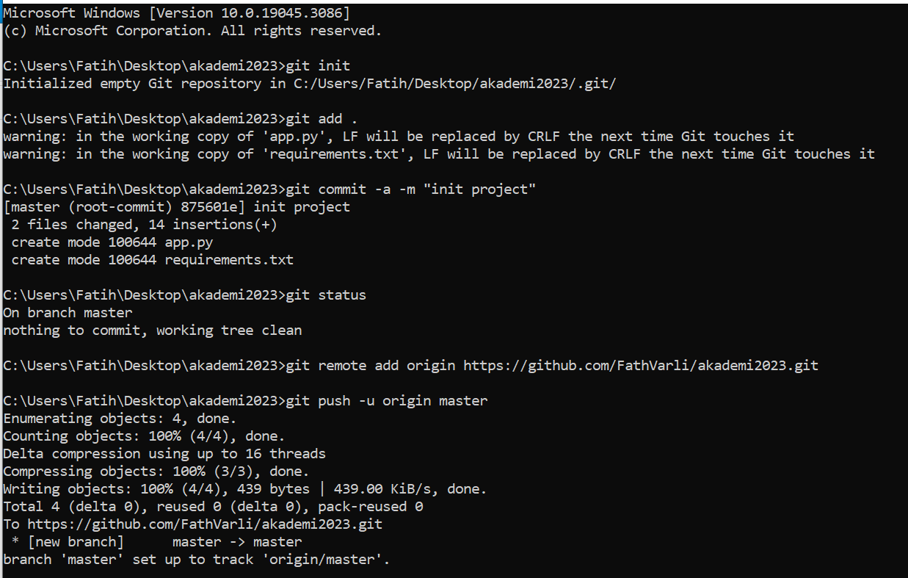
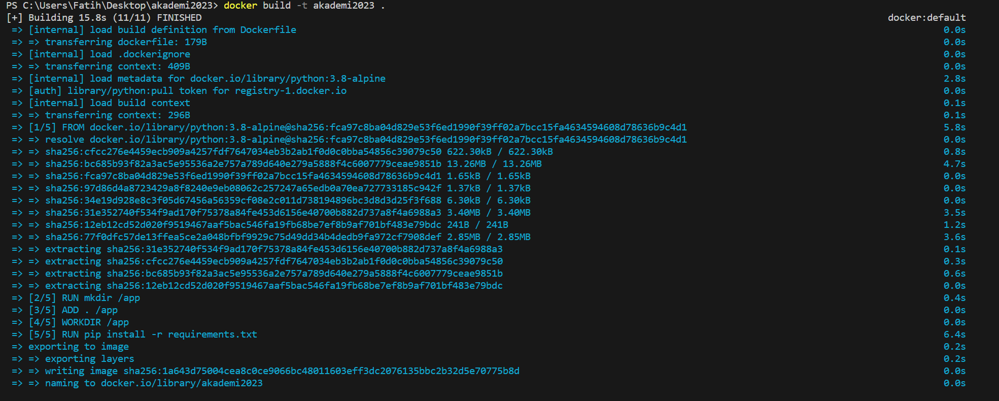
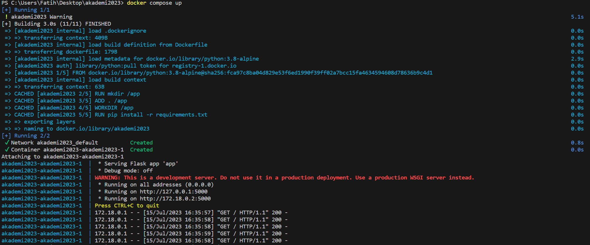
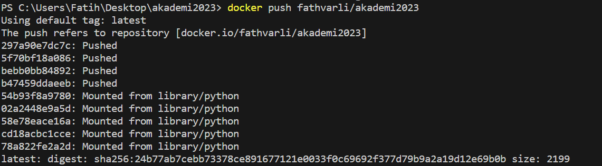
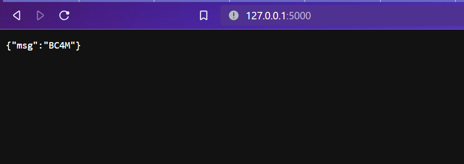

# BestCloudFor.Me Akademi 2023

## 1. Kodun Git Reposuna Yüklenmesi

Projeyi git reposuna yüklemek için kullanılan komutlar aşağıdaki görselde mevcuttur.



## 2. Dockerfile Oluşturulması

Docker file dosyası şu şekilde çalışmaktadır;

- Pythonun 3.8-alpine versiyonunun containera yüklenir.
- app klasörü oluşturulur.
- Bulunulan dizindeki dosyalar app klasörüne kopyalanır.
- App klasörüne gidilir.
- pip ile requirements.txt içindeki paketler indirilir.
- 5000 portu dışarı açılır.
- app.py çalıştırılır.

## 3. Docker Image Oluşturulması ve Docker Huba Pushlanması

İlk olarak Dockerfile kullanılarak bir image oluşturulur. Bunun için şu komut çalıştırılır:

```sh
docker build -t fathvarli/akademi2023 .
```




Bunun dışında oluşturduğum docker-compose.yml dosyası ile de build alınabilir. Build almanın yanında uygulama da run edilmiş olur. Bunun için şu komut çalıştırılır: 

```sh
docker compose up
```




Build alındıktan sonra uygulamayı docker huba pushlamaya hazır hale gelir. Burda önemli nokta image ismi ile docker hubda oluşturulan repository isminin aynı olmasıdır. Pushlamak için şu komut kullanılır:

```sh
docker push fathvarli/akademi2023
```



## 4. Docker Containerın Çalıştırılması

Şu komutla ile docker containerı pull ediyoruz: 

```sh
docker pull fathvarli/akademi2023
```

Şu komutla da çalıştırıyoruz: 

```sh
docker run -p 5000:5000 -it fathvarli/akademi2023
```

